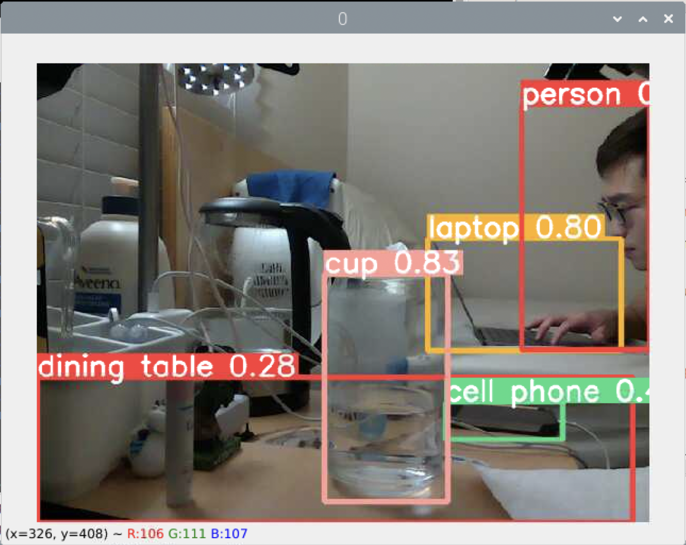
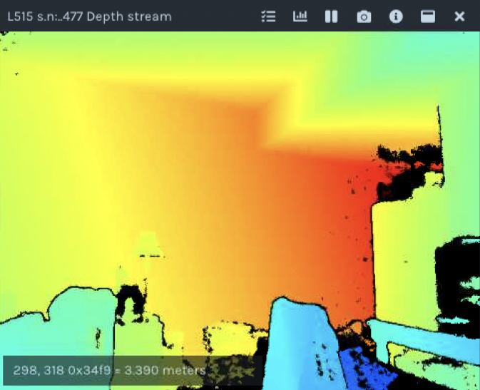
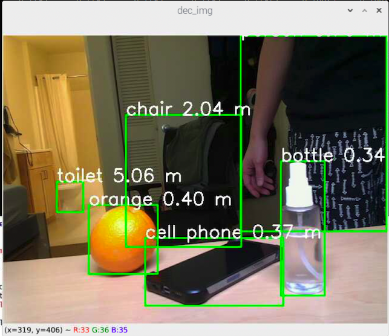
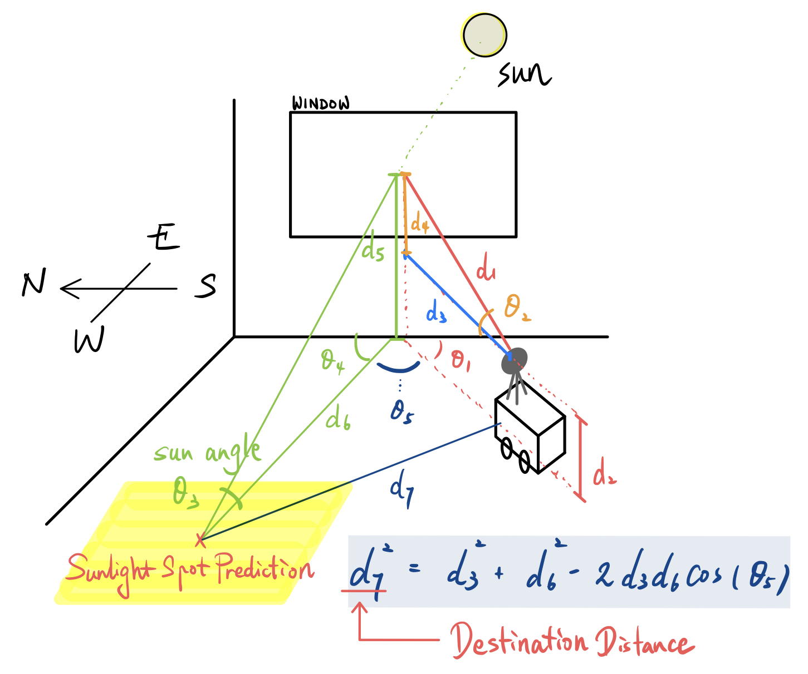
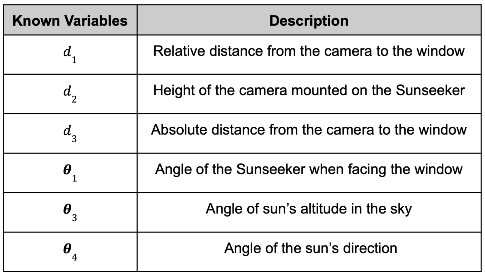
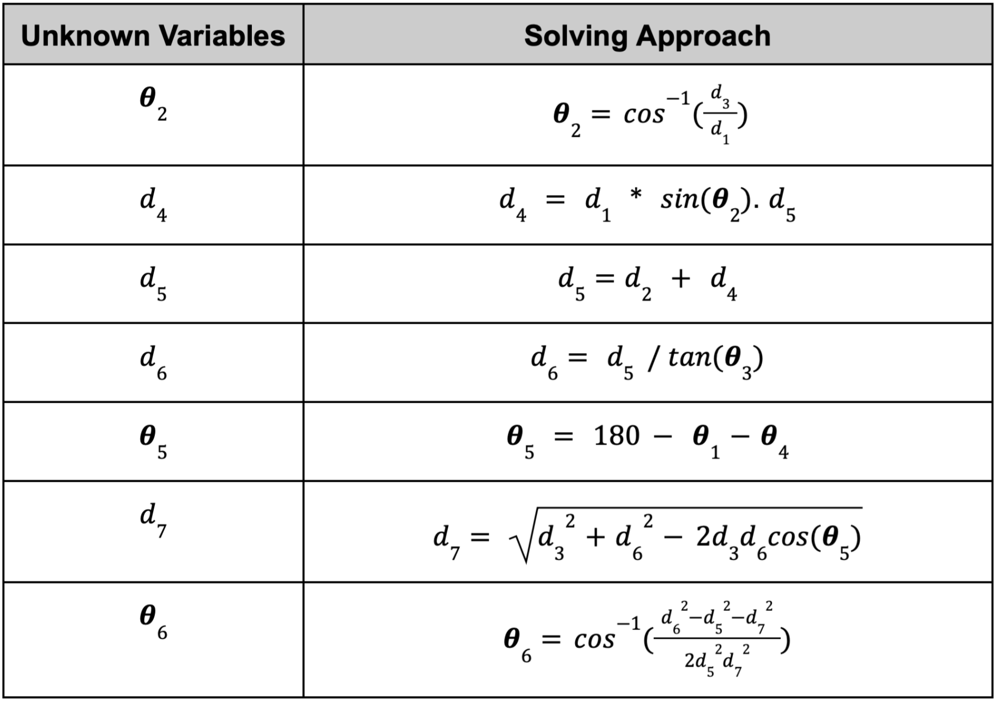
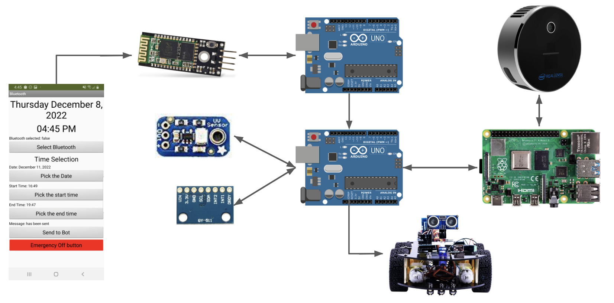
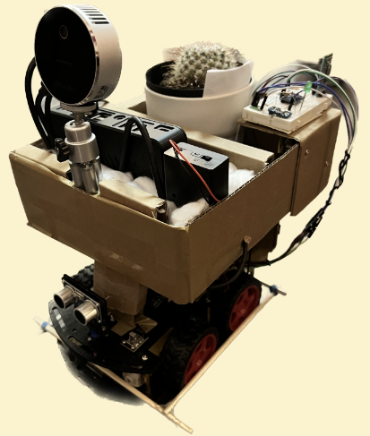
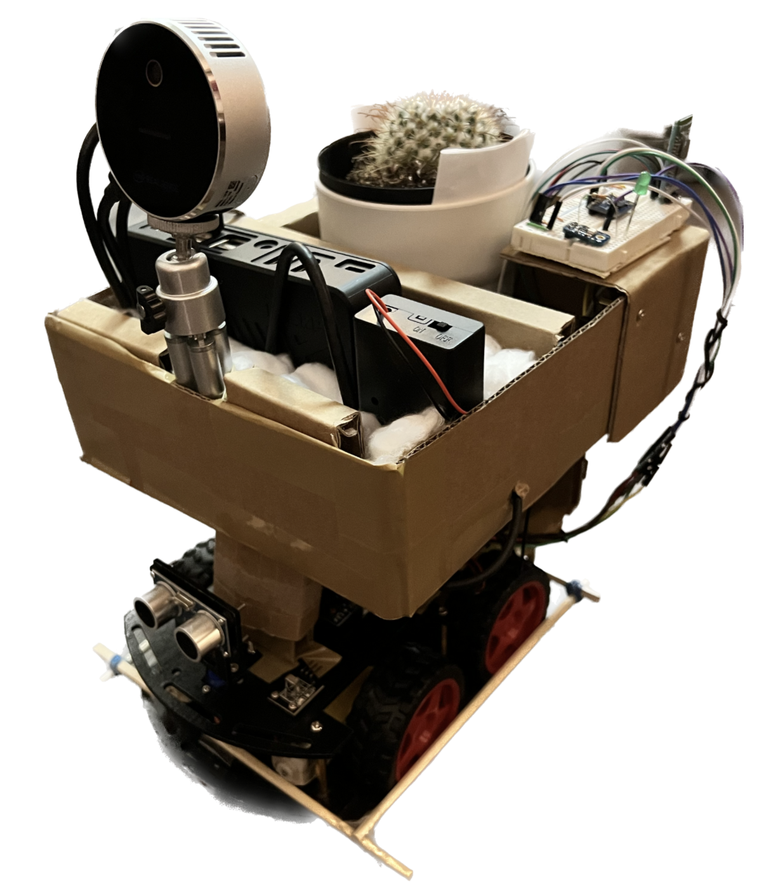

**Disclaimer:** The project is not fully functional. The depth camera does not work with the rest of the robot as intended because the RealSense L515 does not work in a strong amount of sunlight and hence the sunlight spot prediction function would not work when tested in a real scenario, a well-lit room with windows.

# Table of Contents
* Abstract
* [Introduction](#1-introduction)
* [Related Work](#2-related-work)
* [Technical Approach](#3-technical-approach)
* [Evaluation and Results](#4-evaluation-and-results)
* [Discussion and Conclusions](#5-discussion-and-conclusions)
* [References](#6-references)

# Abstract

After indoor time increases, people’s love for houseplants has blossomed, and hence it is no surprise to see indoor gardening continuing to surge in popularity. While some smart gadgets and devices were developed for improving the growth conditions for houseplants, they are limited in watering, soil moisture, and light monitoring, which require owners to take corresponding actions after they are informed. Therefore, in this project, an easier and smarter way of assisting houseplants seek sunlight is proposed and developed. We built an autonomous device with cameras, sensors, and motors that helps houseplants actively look for sunlight without the need of owners interfering. Even though limitations are realized at the late stage of the development process, most of the vital functionalities were fulfilled and shown to work as expected. 

# 1. Introduction

* **Motivation & Objective:** When COVID-19 forced lockdowns and stay-at-home orders, some people adopted a pet and some adopted a plant. Plants have a scientifically supported healing effect with gardening a few times a week being associated with higher levels of perceived well-being, lower stress and increased physical activity [8]. As a result, the popularity in indoor gardening has surged ever since. However, that was during the lockdowns and work-from-home was set to be the new normal, and hence people spent most of their time home, able to take care of their beloved plants most of if not all times. Now, with the coronavirus dying down and most companies returning to on-site working environments, most houseplants however are now left unattended. Even though auto watering devices or plant growth condition monitors exist in the market, little does a device have the functionality that proactively seeks sunlight indoors and autonomously takes the houseplant to bathe under it. In this project, we are inspired to develop and build a self-care houseplant robot that will change houseplant care. Instead of requiring human’s attention and care, now with our Sunseeker, it is capable of taking care of itself by looking for sunlight during the time when the owner is unavailable. 

* **State of the Art & Its Limitations:** Similar existing products that aid houseplant care nowadays mainly focus on auto watering, soil moisture, and light intensity monitoring with the need of the owner stepping in. 

* **Novelty & Rationale:** Our approach focuses on bringing the houseplant to live and seeking what is essential for it without any intervention. With the use of LiDAR for measuring distance and computer vision implementing Yolov5, and multiple other sensors, the Sunseeker is capable of taking care of itself, unlike the existing products that still require owners’ intervention for better growth conditions. 

* **Potential Impact:** Sunseeker offers a choice that owners can have their beloved houseplants self care when they need to. With the increase in indoor gardening over the past few years due to COVID-19 and the returning of on-site working environment for most people in the current climate, we believe our new approach of taking care of houseplants will make the owners' lives more convenient and optimize the growing condition for houseplants. In other words, they can now independently provide themselves with an ideal growth condition.

* **Challenges:** A challenge is to minimize the latency of communication between our edge devices and the robot. Since we have multiple subroutines, there exists a risk of too large latency in our avoidance feature as well as sunlight search functionality, leading to insufficient response in real time when obstacles appear and missing identifying a window when it actually sees one. Another potential challenge could be the communication between Arduino Uno and the Android App as messages transmitted between the two might be misinterpreted and cause time frame input from the user to fail to activate the robot’s modules.

* **Requirements for Success:** What skills and resources are necessary to perform the project? We needed one Raspberry Pi for serving as the brain of the robot that ran object detection and distance measurement. One Arduino Uno controlled the mobility of the robot as well as collected the sensor data from UV detection and compass direction measurement. Another Arduino Uno acted as the Bluetooth module that received string input from users that communicated with the robot. Yolov5, a one-stage CNN object detection and classifier, is required to perform window detection.

* **Metrics of Success:** A metric for success in our project is the ability to identify a window and have its distance measured. The communication between Raspberry Pi and Arduino for the distance and window detection information is another key metric in our project. Since our Sunseeker would be operating inside a person’s room, the ability to avoid obstacles is also one required metric. Another essential would be the sensor measurement as it provides the critical information to predict sunlight location and where and how the bot would navigate. Finally, the last metric is a well connected and working bluetooth app and its communication with our robot, as it plays a vital role in inputting the user's desired working time frame. 

# 2. Related Work

# 3. Technical Approach

Hardware resources:
-	Compass: HiLetgo GY-511 LSM303DLHC [9]
-	UV sensor: Adafruit 1918
-	Depth Cam: Intel RealSense L515
-	UltraSonic: HC-SR04
-	Motor Driver: L298N
-	Bluetooth: HC-06
-	Arduino: Arduino Uno
-	Other auxiliary parts (wires, breadboards, etc.)

Software resources:
-	Arduino IDE
-	MIT App inventor
-	Librealsense [7],[13]
-	PyTorch [11]
-	OpenCV
-	Raspberry Pi [7]
-	Yolov5

## Sunlight Spot Prediction function
* **Window detection:** In order to locate where the sunlight lands on the floor in the room, we need to know where the sun is coming from and hence a search of windows in the robot’s surroundings would be of paramount importance in the first step of sunlight spot prediction. Utilizing Yolov5, You Only Look Once, a single-stage object detection algorithm that provides high inference speeds (see figure 1), our Sunseeker was now equipped with computer vision but without the classification of ‘windows’ [12]. A sequence of training our own dataset was consequently deployed. As the result turned out, however, our trained model with only window data could sometimes end with misjudgment of anything in the shape of square or rectangle. Merging the pre-existing model with our trained window model showed the best result of all, especially using largest model of the YOLOv5 family, YOLOv5l, with 46.5 million parameters, did the fused model show the best identification result as now even small object detection was feasible and that could distinguish windows to stand out from any other objects in the robot’s vision (see figure 2).

  

  Figure1: Yolov5 identifies objects with high accuracy (number represents confidence)

  

  Figure 2: Custom train detection model with Yolov5

* **Distance Measurement:** Now that our Sunseeker had window identification, what was missing here was the distance between the robot and the window so that we could further predict where the sunlight would land. This was when Intel RealSense L515 came in. RealSense L515 is a LiDAR depth camera that emits a laser and has it bounce back to measure the distance from whatever the vision of the camera is at the moment. It has a consistent high accuracy of 0.25 to 9 meters in range, which provides sufficient range for what the Sunseeker would generally need for indoor measurements. 

  

  Figure 3: RealSense Viewer showing depth in meters, different gradient of colors indicates different distances

* **Combine Object Detection and Distance Measurement:** With both the object identification and distance measurement in place, objects in the robot’s vision would be boxed and detected; at the same time, the coordinates of the four corners of the object would be marked to measure the depth from RealSense to that of the center. In figure 4, it is clearly shown that objects on the desk are detected with the correct identification with precise distance measurements, even the toilet further away in the background is as well recognized and measured in distance [10]. A serial communication between the Raspberry Pi and Arduino is essential to receive window requests and transmit the processed distance from and to one another. Two outputs would be transmitted for our final step of determining the location of the sun, which will be explained in details in the next section: first, the distance from the RealSense depth camera to the center of the window, and second, the absolute distance from the camera to the window. 

  

  Figure 4: Yolov5 combined with RealSense outputting identified objects with distance respectively 

* **Distance Data Processed and Sunlight location Predicted:** Details in calculation and prediction of where the sun would land on the floor are illustrated in details in figure 5. After windows are identified and their respective distances measured, the Sunseeker is just one step away from getting to the sunlight spot: the relative angle of the location and the relative distance from the bot to the spot. Before getting started, clarification of what are known is listed in table 1 below. For simplicity, discussion over calculation and trigonometry would be omitted here; instead, they are shown directly in table 2 below as of how the derivation of the final destination distance d7 and relative rotation angle of the robot 𝜽6. After prediction, now the Sunseeker just needs to rotate 𝜽6 degrees and go straight forward by d7 meters and the sunlight spot search would be complete.

  

  Figure 5: Details on the derivation of the sunlight location [6]

  
  

  Table 1: A list of the known variables before sunlight prediction 
  $~~~~~~~~~~~~~$  
  Table 2: A list of the unknown and the solving approach 

## Bluetooth Module
The Bluetooth app for the android phone is written by the MIT app inventor developer. The App inventor uses a scratch program. The MIT app inventor has a builtin bluetooth client that would allow to send a message. [4] In this project, we would be using a String message to send a message to the bluetooth device on the robot. The robot uses the arduino HC-06 module to receive the String message. [1] The String message includes the time the message is sent, the start time for the robot, and the time duration for the robot to run all the subroutines. The time the message sent would tell the arduino what the current time is and that is the start time of the arduino count down. The start time for the robot is the time when the rest of the robot needs to activate all the other modules like the Camera, UV sensor, and Compass. The other modules are activated using GPIO input from one arduino with the bluetooth to the other arduino connected to the rest of the other modules since the first arduino is occupied with the RX and TX for the bluetooth and the Camera’s Raspberry Pi uses the RX and TX for communication [3]. Once the internal timer counts up to the end time, which is the duration time added to the start time, the robot will stop running all the other modules. All the inputs are shown in the figure below.

  

  Figure 6: Input UI on Android phone for the bluetooth communication with Arduino Uno

## Sunlight Trajectory Prediction function
The sunlight trajectory prediction is to predict the angle of the sunlight movement based on the initial position. The sunlight trajectory prediction must be at the spot that the Sunlight Spot prediction made. The robot would start moving back and forth for a specific distance calculated from the absolute distance from the robot. The robot will constantly check for the UV light. Once the UV is detected the angle measured from the compass would be stored into an array element in the Arduino. Once a 30 minute cycle has passed, it would use the angle that the compass measured and move forward to see if the UV light is present on the spot. If the robot does not find UV light it would restart to the original start degree from the sunlight spot prediction. Once it is able to find the new spot it would store the new degree as an additional array element. The array would add all the degrees together and get the average degree and use the degree for the next cycle.

  

  Figure 7: Communication between the UV sensor and Compass to the robot 

  

  Figure 8: Three approaches combined together 

## Bot Design:
The top box is 7 cm by 19.5 cm by 22.5 cm. The bottom pillars below the box are 7.5 cm tall. The camera is set in the front with the batteries and Raspberry Pi. The back where the breadboard with the UV light sensor and compass and bluetooth are aligned with the plant as shown in the figure below.

  
<!--   
   -->

  Figure 9: Sunseeker top angle view 

# 4. Evaluation and Results

Although the full robot was not fully functional, we were able to show some of the functions working with the measurements for the robot for future work purposes. 
## Window Identification and Distance Measurement
<!-- https://youtu.be/_z0maoXT3IM -->

  Click thumbnail above to see demo

Before predicting the sunlight spot in the room, the Sunseeker needs to be capable of recognizing a window and how far it is. In this demo video, we start with the robot not detecting anything yet in its current position, and hence even though Arduino Uno is trying to request window data, nothing is transmitted through the Serial. Once the robot turns to the right side where a window locates right upfront, it is shown that the Sunseeker immediately picks up the window and marks the distance on the streaming window on our Raspberry Pi. In the terminal window, we can also observe that the distance of the window and its absolute distance are both sent through to Arduino Uno for the trigonometry calculation discussed previously in our technical approach section. 

## UV Check

  Click thumbnail above to see demo

As seen in this demo video, Sunseeker has already started and is now working within the time frame inputted from the user. What is being tested here is whether or not the robot would be able to stop once UV light is detected, even though it is still operating under instruction of the user. The UV level is usually tested 0.00 when indoors without any sunlight, so any spike in UV number would be considered UV. However, this demo was conducted outdoors due to our room limitation. Since UV could be scattered or diffused even in the shadow outdoors, for testing and demonstration purposes, we raised the UV threshold up to 0.21. As shown in the end of the video, once the UV level reaches 0.21, the Sunseeker comes to a stop while the indication green LED remains turned on.

## Bluetooth Input Time Frame from User

  Click thumbnail above to see demo

In this video, Bluetooth communication between the user’s Android App and the Sunseeker is being conducted. As shown, we first select the desired Bluetooth connection in the App, choosing HC-06 in this case, which is the Bluetooth module we have on the robot. Next, the starting date and time can be inputted with a few clicks as well as the end time. In this demo, the current time is set to be 01:30 pm, and starting and end time are 01:31 pm and 01:32 pm respectively. We can see that the green LED in the back turns on and the robot immediately starts the window search process once the time hits 01:31 pm. After a minute of search the Sunseeker comes to a stop when the clock hits 01:32 pm and the LED turns off.

# 5. Discussion and Conclusions

## Conclusions
The report presents the sunseeker robot, which is designed to have a mobile plant robot that would lead to the best sunlight place and update to the next best spot in the cycle of time. The two Arduino Uno would receive the timer from the phone app and activate the UV light module, compass module and sunseeker’s motors. It would also send a window request to the Raspberry Pi to activate the window detection and distance measurement functionality. The Sunseeker uses the RealSense depth camera to search windows and get the distance and absolute distance from the closest window detected, and send them in as a String message in serial communication. Once window data is successfully received on the Arduino Uno’s end, the robot would activate the motor, and head towards the sunlight spot after rotating to where the spot locates. Finally, the UV light sensor would be activated and used as an indication if the robot has found a sunlight spot. A sunlight trajectory prediction function would be then activated after a certain amount of time for future sunlight spot prediction as discussed above in the technical approach. If anything fails during the process, the robot would start over by looking for any closet window while navigating in the room with the obstacle avoidance functionality on. 

As sound as it seems, the Sunseeker actually suffers from multiple limitations, including first and foremost, the unexpected performance of the vision of the robot, heavy load of weight due to hardware limitations that might affect the mobility of the Sunseeker, limited memory to keep track of the trajectory tests, and finally the bluetooth connection 

## Limitation
As mentioned in the disclaimer, the robot is not fully functional because the camera is required to work in the condition where the sunlight is minimal. When we tested the Camera, we realized the camera does not work with high levels of sunlight, since it uses infrared to tell depth. The use of the infrared in the camera would get interrupted with the sunlight that shines into the room. This issue would interfere with the distance measurement even if any windows are identified. Consequently, it would block the sequential step of predicting the sunlight spot using the trigonometry calculation to find the ideal sunlight spot for the robot to move to. 

The robot also has a relatively slow speed when traveling around the room due to the weight of the added modules in the robot. The full combined weight of the robot is around 2 kg. There are battery management limitations. The battery use for the robot is limited for a couple days since the 4 DC motors are powered with two 4.2 Volt lithium batteries. 

There is a limitation of the amount of memory that can be used within the Arduino and since we have the robot set in a certain. We set a specific array size to 4 elements since we used that number to test since it is a small enough number to keep track of the test we had. If we had more time to work on the sun seeker robot, we would be able to test for a larger amount of elements in the array. 
Due to the development time limitation, we did not build our Android app to the fullest. The bluetooth App is limited to single day inputs with single segmented times. Hence, if the user would not be home for over a day, it will be implausible for them to schedule a proper time frame for the robot to work. 

## Future Work
As we did some research after realizing the limitation of RealSense L515 at the very late stage of development, ideally, we would instead need to use a camera that can handle strong sunlight, specifically RealSense 400 Series stereo depth cameras, which actually work excellently in both indoor and outdoor sunlight [14].

A stronger motor and lighter power management would be greatly beneficial to operate this robot as well. For the Android App, we would include multiple days that can be displayed and the information would be saved into the arduino where the internal clock would be running to keep track of the exact time and hold all the times that needs to be active. 

We would also additionally include the weather API for the bluetooth application, where the app would get the exact weather so the robot could save power if the weather predicted is not sunny.

Finally, a thermal camera would be beneficial for double confirming if the predicted spot on the floor actually has sunlight, or due to minor error of prediction, the robot needs to make some direction and/or distance adjustments. We believe this can strengthen the sunlight prediction function.

# 6. References
[1] Juan_Antonio. “Bluetooth HC-06. Arduino. Send. Receive. Send Text File. Multitouch. Image.” MIT App Inventor Community, 22 May 2020, https://community.appinventor.mit.edu/t/bluetooth-hc-06-arduino-send-receive-send-text-file-multitouch-image/9518/2  

[2] “AIRCCSE - International Publisher Computer Science, Technology,Engineering.” Airccse.org, https://www.airccse.org/ 

[3] Ed. “Raspberry Pi Arduino Serial Communication - Everything You Need to Know - the Robotics Back.” End, 15 Nov. 2021, https://roboticsbackend.com/raspberry-pi-arduino-serial-communication/ 

[4] “Release Notes for MIT App Inventor 2.” Release Notes for MIT App Inventor 2, MIT App Inventor, http://appinventor.mit.edu/ai2/ReleaseNotes 

[5] “Object Detection with yolov5 and Pytorch.” Section, https://www.section.io/engineering-education/object-detection-with-yolov5-and-pytorch/ 

[6] “Los Angeles, CA, USA - Sunrise, Sunset, and Moon Times for Today.” Sun & Moon Times Today, Los Angeles, California, USA, https://www.timeanddate.com/astronomy/usa/los-angeles 

[7] Datasith. “Raspberry Pi 4 and Intel Realsense D435 · Datasith/ai_demos_rpi Wiki.” GitHub, https://github.com/datasith/Ai_Demos_RPi/wiki/Raspberry-Pi-4-and-Intel-RealSense-D435. 

[8] Ferraro, Kathleen. “How Gardening Became a Wellness Practice among Millennials.” Bustle, Bustle, 21 June 2021, https://www.bustle.com/wellness/gardening-wellness-trend-millennial-self-care-benefits. 

[9] Helscream. “Helscream/HMC5883L_HEADER_ARDUINO_AUTO_CALIBRATION: HMC5883L on Arduino with Auto Calibration Capability.” GitHub, https://github.com/helscream/HMC5883L_Header_Arduino_Auto_calibration. 

[10] Killnice. “Killnice/Yolov5-D435I: Using Yolov5 and Realsense d435i.” GitHub, https://github.com/killnice/yolov5-D435i. 

[11] Politiek, Rients. “Install Pytorch on Raspberry Pi 4 - Q-Engineering.” Q, Q-Engineering, 5 Dec. 2022, https://qengineering.eu/install-pytorch-on-raspberry-pi-4.html. 

[12] “Raspberry Pi 4 yolov5 Object Detection | Yolov5 Raspberry PI4 | Yolov5 Object Detection.” YouTube, YouTube, 30 Sept. 2022, https://www.youtube.com/watch?v=cCnrnt86Rak. 

[13] Syoyo. “Syoyo/TBB-AARCH64: Intel TBB with CMake Build System.” GitHub, https://github.com/syoyo/tbb-aarch64.

[14] D435i Sunlight – Intel Realsense Help Center. https://support.intelrealsense.com/hc/en-us/community/posts/441584740883-D435i-sunlight. 
